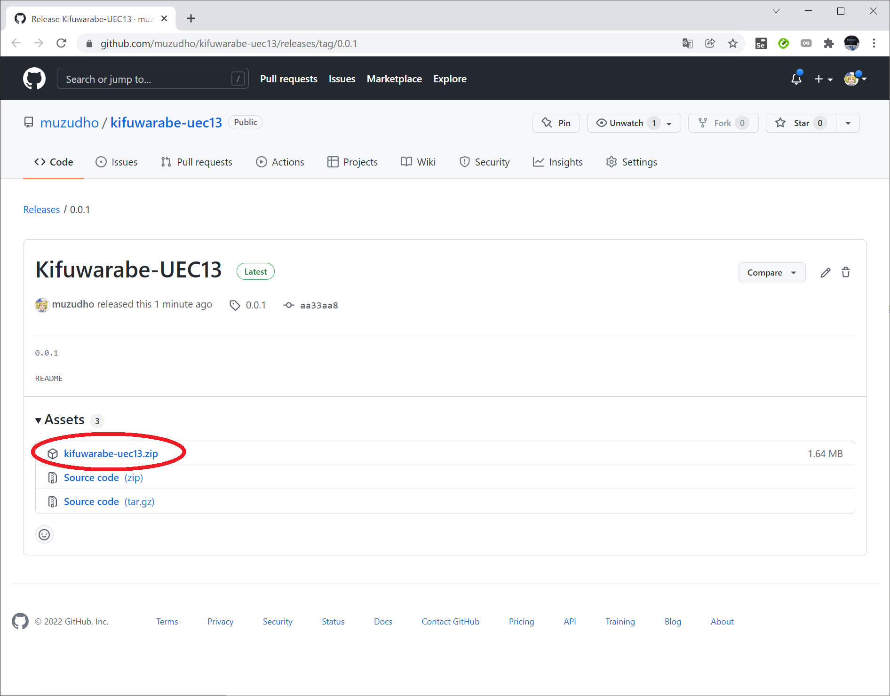
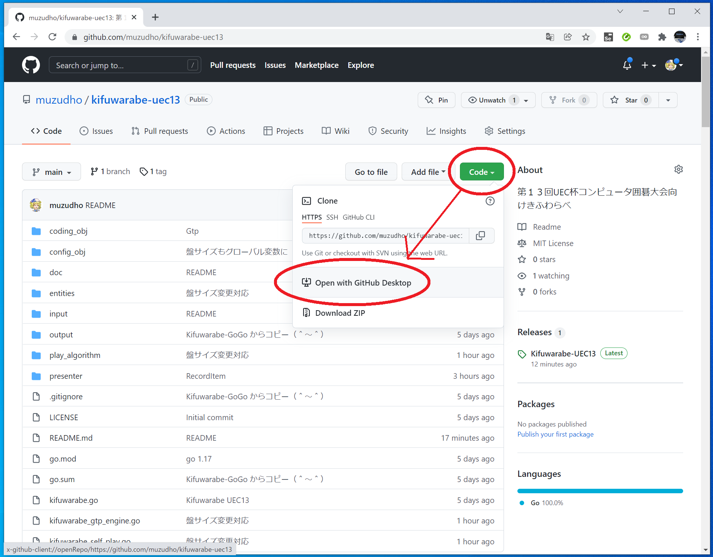
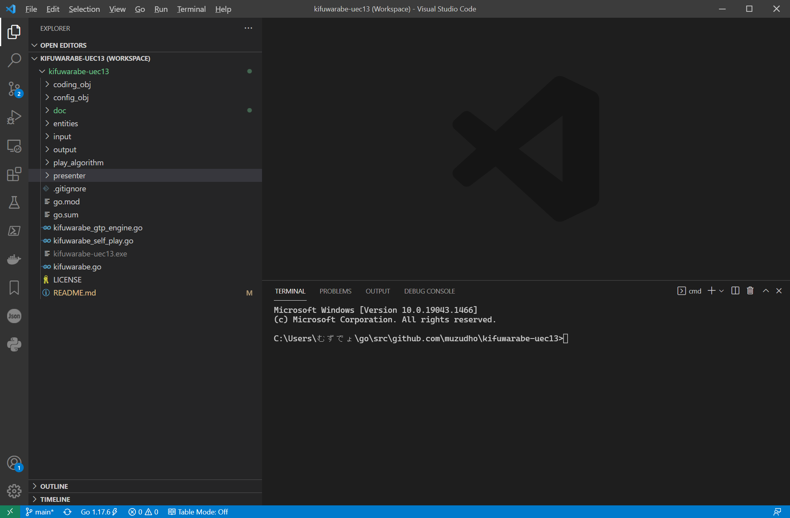

# kifuwarabe-uec13

第１３回UEC杯コンピュータ囲碁大会向けきふわらべ  

GoGo をベースとしています  
📖 [GoGo](https://github.com/bleu48/GoGo)  

# Set up

## Set up - 1

きふわらべは 思考エンジンだけですので、GUI が別途必要です。  
ここでは CgfGoBan で動かす例を示します。  

  

📖 [CgfGoBan](http://www.yss-aya.com/cgfgoban_j.html)  

👆 CgfGoBan のページから英語版に飛んでください  

  

👆 `Download CgfGoBan 1.08 2015/03/16` をクリックして `cgfgoban108.zip` ファイルをダウンロードしてきてください  

  

👆 がんばって好きなところに解凍してください  

  

👆 最初の中身はこんな感じです  

## Set up - 2

  

👆 CgfGoBan の `cgfgoban.exe` ファイルと同じディレクトリーに、  
以下の図を参考に `📂input/game_conf.toml` と `📂output`（空ディレクトリー） を置いてください  
`game_conf.toml` は、この Git hub の `📂input` の中に置いてあります  

```plain
📂 cgfgoban108
|
+----📂 input
|    |
|    +----📄 game_conf.toml (設定ファイル)
|
+----📂 output （空っぽ）
|
+----📄 cgfgoban.exe

```

game_conf.toml テキストファイルの内容は以下の通りです  

```toml
[Game]
# デフォルト値です。 CgfGoBan などの GUI はこのファイルを見ません

# Komi - コミ☆（＾～＾）
Komi = 6.5

# BoardSize - 何路盤。
BoardSize = 19

# MaxMoves - 最大手数。
MaxMoves = 1000

BoardData = '''
	3, 3, 3, 3, 3, 3, 3, 3, 3, 3, 3, 3, 3, 3, 3, 3, 3, 3, 3, 3, 3,
	3, 0, 0, 0, 0, 0, 0, 0, 0, 0, 0, 0, 0, 0, 0, 0, 0, 0, 0, 0, 3,
	3, 0, 0, 0, 0, 0, 0, 0, 0, 0, 0, 0, 0, 0, 0, 0, 0, 0, 0, 0, 3,
	3, 0, 0, 0, 0, 0, 0, 0, 0, 0, 0, 0, 0, 0, 0, 0, 0, 0, 0, 0, 3,
	3, 0, 0, 0, 0, 0, 0, 0, 0, 0, 0, 0, 0, 0, 0, 0, 0, 0, 0, 0, 3,
	3, 0, 0, 0, 0, 0, 0, 0, 0, 0, 0, 0, 0, 0, 0, 0, 0, 0, 0, 0, 3,
	3, 0, 0, 0, 0, 0, 0, 0, 0, 0, 0, 0, 0, 0, 0, 0, 0, 0, 0, 0, 3,
	3, 0, 0, 0, 0, 0, 0, 0, 0, 0, 0, 0, 0, 0, 0, 0, 0, 0, 0, 0, 3,
	3, 0, 0, 0, 0, 0, 0, 0, 0, 0, 0, 0, 0, 0, 0, 0, 0, 0, 0, 0, 3,
	3, 0, 0, 0, 0, 0, 0, 0, 0, 0, 0, 0, 0, 0, 0, 0, 0, 0, 0, 0, 3,
	3, 0, 0, 0, 0, 0, 0, 0, 0, 0, 0, 0, 0, 0, 0, 0, 0, 0, 0, 0, 3,
	3, 0, 0, 0, 0, 0, 0, 0, 0, 0, 0, 0, 0, 0, 0, 0, 0, 0, 0, 0, 3,
	3, 0, 0, 0, 0, 0, 0, 0, 0, 0, 0, 0, 0, 0, 0, 0, 0, 0, 0, 0, 3,
	3, 0, 0, 0, 0, 0, 0, 0, 0, 0, 0, 0, 0, 0, 0, 0, 0, 0, 0, 0, 3,
	3, 0, 0, 0, 0, 0, 0, 0, 0, 0, 0, 0, 0, 0, 0, 0, 0, 0, 0, 0, 3,
	3, 0, 0, 0, 0, 0, 0, 0, 0, 0, 0, 0, 0, 0, 0, 0, 0, 0, 0, 0, 3,
	3, 0, 0, 0, 0, 0, 0, 0, 0, 0, 0, 0, 0, 0, 0, 0, 0, 0, 0, 0, 3,
	3, 0, 0, 0, 0, 0, 0, 0, 0, 0, 0, 0, 0, 0, 0, 0, 0, 0, 0, 0, 3,
	3, 0, 0, 0, 0, 0, 0, 0, 0, 0, 0, 0, 0, 0, 0, 0, 0, 0, 0, 0, 3,
	3, 0, 0, 0, 0, 0, 0, 0, 0, 0, 0, 0, 0, 0, 0, 0, 0, 0, 0, 0, 3,
	3, 3, 3, 3, 3, 3, 3, 3, 3, 3, 3, 3, 3, 3, 3, 3, 3, 3, 3, 3, 3,
'''
```

## Set up - 3

次に、以下から きふわらべの `kifuwarabe-uec13.exe` ファイルを入手してください。  

  

📖 [Kifuwarabe-uec13 Release 0.0.1](https://github.com/muzudho/kifuwarabe-uec13/releases/tag/0.0.1)

👆 .zip に圧縮されているので、解凍してください。  
もし ウィルス扱いされてダウンロードできないなら、 以下の方法で、ソースをビルドして kifuwarabe-uec13.exe を作ってください。  

## Set up - 4

きふわらべの .exe をソースからビルドして作る方法です。  

  

👆 きふわらべのソースコードは、Git hub から入手できます  
**がんばって** `GitHub Desktop` をインストールしておいてください。  

  

📖 [Visual Studio Code](https://code.visualstudio.com/)  

👆 プログラムを編集するツールとしては Visual Studio Code で十分でしょう。 **がんばって** インストールしてください  
上図画面下のコマンドを打つところは **ターミナル** という名前です。 **がんばって** 表示してください。  

📖 [Go Downloads](https://go.dev/dl/)  

👆 Go言語を **がんばって** インストールしてください  

## Set up - 4

```shell
go build
```

👆 実行ファイルを作成してください。 `kifuwarabe-uec13.exe` ファイルが作成されます  

# Run

```shell
# GTP形式の思考エンジンとして対局するなら
kifuwarabe-uec13

# 動作テストするなら
kifuwarabe-uec13 SelfPlay
```

👆 拡張子を省いた実行ファイル名を打鍵してください
